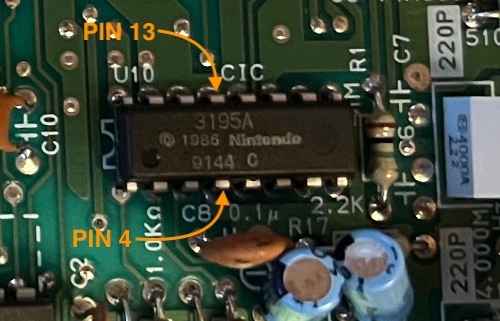
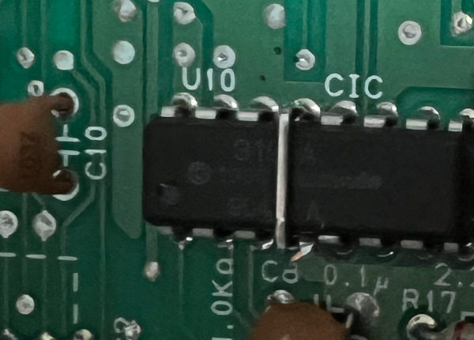

# CIC mod

Pour dézoner la NES, tout se situe sur le composant U10 (CIC). il suffit de déconnecter
la broche N°4 du PCB et de la raccorder à la masse (ou sur la broche N°13 de ce même composant).

Après modification :

